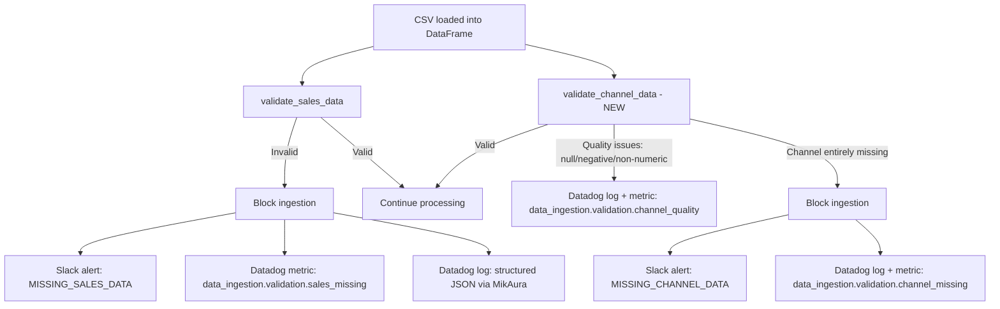

# Channel and Sales Data Staleness Validation

## Context

The current `stale_data_check` Lambda only checks client-level staleness (whether `last_data_updated` exceeds a threshold). There is no per-row validation of **media channel data quality** (null/negative/non-numeric impressions) or enforcement that **missing sales data blocks ingestion with dual alerts**. The user requests four specific behaviors.

## Data Model Recap

Media channel columns in the SOT schema (from `reorder_columns_sot` in [lambda_function.py](data_ingestion_pipeline/lambdas/mmm_dev_data_transfer/lambda_function.py)):

- `OOH_impressions`, `OOH_spend`
- `PaidSocial_impressions`, `PaidSocial_spend`
- `TV_impressions`, `TV_spend`
- Plus retailer-specific `{Retailer}_impressions`, `{Retailer}_spend`

Sales columns: any column whose normalized name is `sales` or ends with `_sales`.

## Requirements Mapping

| #   | Requirement                                                                    | Action                | Alert Channels  | Block Ingestion? |
| --- | ------------------------------------------------------------------------------ | --------------------- | --------------- | ---------------- |
| 1   | Media channel is null, or impression is null/negative/not float or int         | Log + send to Datadog | Datadog only    | No               |
| 2   | Must be logged and sent to Datadog                                             | (covered by #1)       | Datadog         | -                |
| 3   | Sales data missing in updated row -> block ingestion + alert Datadog AND Slack | Block + dual alert    | Datadog + Slack | **Yes**          |
| 4   | Channel data missing -> block ingestion + alert Datadog AND Slack              | Block + dual alert    | Datadog + Slack | **Yes**          |

## Architecture

## Files to Change

### 1. Data Transfer Lambda (main validation logic)

**File:** [data_ingestion_pipeline/lambdas/mmm_dev_data_transfer/lambda_function.py](data_ingestion_pipeline/lambdas/mmm_dev_data_transfer/lambda_function.py)

**A. New function: `validate_channel_data`** (add near `validate_sales_data` at ~line 2456)

Checks all `*_impressions` and `*_spend` columns (both media and retailer-specific) for:

- Null/NaN values
- Negative values
- Non-numeric types (not int or float)

Returns a tuple `(has_quality_issues, is_channel_missing, details)` where:

- `has_quality_issues` = True if any impression/spend cell is null, negative, or non-numeric (Req #1)
- `is_channel_missing` = True if an entire media channel column is absent or fully null (Req #4)
- `details` = list of dicts describing each issue

**B. Integrate into `process_with_pandas`** (~line 2610, after the existing sales validation block)

Call `validate_channel_data` and:

- If `has_quality_issues` (but channel not fully missing): log via `_transfer_warning` + emit Datadog metric `data_ingestion.validation.channel_quality` (Req #1, #2). Do NOT block ingestion.
- If `is_channel_missing`: log via `_transfer_error` + emit Datadog metric `data_ingestion.validation.channel_missing` + send Slack alert via `send_missing_channel_alert` (new helper) + return `{}` to block ingestion (Req #4).

**C. Enhance existing sales validation block** (~line 2633)

The current code already blocks ingestion and sends a Slack alert when sales data is invalid. Add:

- Emit Datadog metric `data_ingestion.validation.sales_missing` via `MetricsUtils.increment` or `MikAuraMetricLogger.increment` (Req #3)
- The existing Slack alert (`send_invalid_sales_alert`) already covers the Slack side.

**D. New helper function: `send_missing_channel_alert`** (in data transfer lambda)

Invoke the Slack Lambda asynchronously with `alert_type: 'MISSING_CHANNEL_DATA'`, following the same pattern as `send_invalid_sales_alert` (line ~1116). Payload includes `client_id`, `brand_name`, `retailer_id`, `filename`, `missing_channels` (list of absent/fully-null channel column names), and `quality_issues` (list of per-column issue details).

**E. New helper function: `send_channel_quality_metrics`**

Emit Datadog metrics for channel quality issues using the existing `MetricsUtils` / `MikAuraMetricLogger` pattern (UDP DogStatsD to 127.0.0.1:8125).

### 2. Slack Lambda (new `MISSING_CHANNEL_DATA` alert type)

**File:** [data_ingestion_pipeline/lambdas/data_ingestion_slack/lambda_function.py](data_ingestion_pipeline/lambdas/data_ingestion_slack/lambda_function.py)

Add a new alert type `MISSING_CHANNEL_DATA` following the existing pattern (like `INVALID_SALES_DATA`):

- `**format_missing_channel_alert`**: Builds a Slack Block Kit message with danger/red styling, listing which channels are missing/fully-null, client/brand/retailer context, and a "FILE INGESTION BLOCKED" header.
- `**handle_missing_channel_alert`**: Extracts fields from event, calls `format_missing_channel_alert`, sends via `send_slack_notification`.
- **Route in `lambda_handler`**: Add a new `if event.get('alert_type') == 'MISSING_CHANNEL_DATA'` branch (alongside the existing `INVALID_SALES_DATA` branch) to dispatch to `handle_missing_channel_alert`.

### 3. Tests

**File:** [data_ingestion_pipeline/tests/layers/compute/unit/test_content_validations.py](data_ingestion_pipeline/tests/layers/compute/unit/test_content_validations.py)

Add new test class/functions for `validate_channel_data`:

- `test_valid_channel_data_passes` -- all impressions/spend numeric and non-negative
- `test_null_impressions_detected` -- null in `OOH_impressions` flagged
- `test_negative_impressions_detected` -- negative value flagged  
- `test_non_numeric_impressions_detected` -- string value flagged
- `test_missing_channel_blocks_ingestion` -- fully absent media channel column
- `test_missing_channel_sends_slack_alert` -- verify Slack Lambda invocation when channel missing
- `test_sales_missing_emits_datadog_metric` -- verify metric call when sales invalid

## Key Implementation Details

- **Media channel detection**: reuse the existing `media_channels_lower` set (`ooh_impressions`, `ooh_spend`, `paidsocial_impressions`, `paidsocial_spend`, `tv_impressions`, `tv_spend`) plus retailer-specific `*_impressions`/`*_spend` columns (same logic as `reorder_columns_sot`).
- **Datadog metrics**: use the existing `_transfer_metrics` / `get_metrics_utils()` singleton pattern already present in the lambda (DogStatsD UDP to 127.0.0.1:8125 via [metrics_utils.py](data_ingestion_pipeline/src/utils/metrics_utils.py)).
- **Structured Datadog logs**: use `_transfer_error` / `_transfer_warning` which delegate to `MikAuraStatusLogger` -- these emit JSON to stdout, which the Datadog Lambda Extension picks up automatically.
- **Ingestion blocking**: return `{}` from `process_with_pandas` (same pattern as existing sales validation failure at line 2660).

