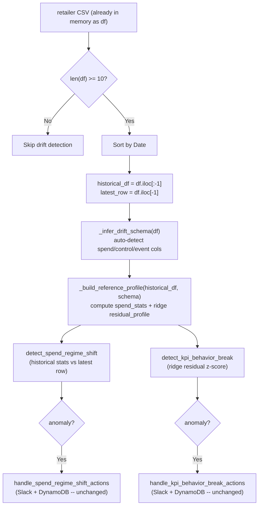

# Dynamic In-Memory Drift Detection (No profile.json)

Single file to modify: [lambda_function.py](data_ingestion_pipeline/lambdas/mmm_dev_data_transfer/lambda_function.py)

The Lambda will compute a reference profile in-memory from each retailer's own historical data, score the latest row, and discard the profile. No file is read or written.

---

## How it works (end-to-end flow)




---

## Step 1: Delete profile.json infrastructure

Remove these **module-level variables** (lines 276-287):

- `DRIFT_PROFILE_PATH`
- `_DRIFT_PROFILE_CACHE`
- `_DRIFT_PROFILE_LOADED`

Remove these **functions** entirely:

- `_resolve_profile_path()` (lines 305-320) -- searches filesystem for profile.json
- `load_drift_profile()` (lines 323-362) -- reads and caches profile.json
- `_predict_log_kpi_from_profile()` (lines 585-635) -- uses static beta coefficients
- `_get_total_spend_mean()` (lines 556-564) -- reads spend_stats from profile dict

**Keep** these unchanged:

- `_to_float()` (line 295)
- `_safe_log1p()` (line 539)
- `_is_event_transition_ended()` (line 546)
- `_validate_kpi_alert_payload()` (line 567)
- All threshold defaults (`SPEND_REGIME_Z_YELLOW_DEFAULT = 3.0`, etc.)

---

## Step 2: Add new constants and helper functions

Insert after `_to_float()` (~line 303). These are ported from the Colab notebook.

**New constants:**

```python
RIDGE_LAMBDA = 10.0

KNOWN_CONTROL_COLS = ["GQV", "Seasonality"]
KNOWN_EVENT_COLS = [
    "Valentine", "Easter", "Thanksgiving", "Christmas",
    "SuperBowl", "CyberMonday", "NewYear", "BackToSchool",
]
```

`**_robust_percentile(x, p)**` -- finite-safe percentile:

```python
def _robust_percentile(x, p):
    x = np.asarray(x, dtype=float)
    x = x[np.isfinite(x)]
    return float(np.quantile(x, p)) if len(x) > 0 else float("nan")
```

`**_zscore(x, mu, sigma)**` -- safe z-score:

```python
def _zscore(x, mu, sigma):
    if sigma <= 1e-12 or not np.isfinite(sigma):
        return 0.0
    return (x - mu) / sigma
```

`**_infer_drift_schema(df, kpi_col)**` -- auto-detect column roles:

- `spend_cols`: all columns ending in `_spend`
- `control_cols`: intersection of `KNOWN_CONTROL_COLS` with df columns
- `event_cols`: `KNOWN_EVENT_COLS` present in df, plus any other binary (0/1) columns
- Returns dict: `{ kpi_col, spend_cols, control_cols, event_cols }`

`**_ridge_fit_predict(X, y, lam)**` -- pure numpy ridge regression:

```python
def _ridge_fit_predict(X, y, lam=RIDGE_LAMBDA):
    X = np.asarray(X, dtype=float)
    y = np.asarray(y, dtype=float).reshape(-1, 1)
    I = np.eye(X.shape[1])
    beta = np.linalg.solve(X.T @ X + lam * I, X.T @ y).ravel()
    yhat = (X @ beta).ravel()
    return beta, yhat
```

`**_build_reference_profile(historical_df, drift_schema)**` -- the core builder:

Computes from `historical_df` (all rows except last):

- **spend_stats** per spend column: `mean`, `std`, `p99`, `p995`
- **control_stats** per control column: `mean`, `std`
- **residual_profile**: fits ridge regression `log1p(KPI) ~ log1p(spend) + z(controls) + events + intercept`, stores `beta`, `resid_mean`, `resid_std`, `feature_names`

Returns a plain dict (in-memory only, never persisted).

---

## Step 3: Rewrite `detect_spend_regime_shift` (lines 365-434)

New signature (no `profile` parameter):

```python
def detect_spend_regime_shift(
    historical_df, latest_row, spend_cols
) -> Dict[str, Any]:
```

Per spend column:

- Compute `mean`, `std`, `p99`, `p995` from `historical_df[col]`
- `z_score = (latest_value - mean) / std`
- YELLOW if `|z| >= 3` or `value > p99`; RED if `|z| >= 4` or `value > p995`
- Skip columns with `std <= 0` or all-NaN

Returns same payload shape as before: `{ detected, severity, anomalies[], drift_metric_current, evaluated_channels }`

---

## Step 4: Rewrite `detect_kpi_behavior_break` (lines 638-778)

New signature:

```python
def detect_kpi_behavior_break(
    historical_df, latest_row, ref_profile, drift_schema
) -> Dict[str, Any]:
```

Logic:

- Build feature vector for `latest_row` using same transforms as profile builder (log1p spend, z-scored controls, event flags, intercept)
- `predicted = dot(features, beta)`, `actual = log1p(latest_kpi)`
- `residual = actual - predicted`
- `resid_z = (residual - resid_mean) / resid_std`
- YELLOW if `|resid_z| >= 3`, RED if `|resid_z| >= 4`
- Opposite direction check: `spend_delta * kpi_delta < 0` with magnitude + event-transition guards
- `total_spend_mean` = sum of spend_stats means from `ref_profile` (replaces `_get_total_spend_mean`)

Returns same payload shape as before: `{ detected, severity, anomalies[], drift_metric_current, opposite_direction, event_transition_ended }`

---

## Step 5: Update integration block (lines 4118-4191)

Replace the two separate ME-5401 / ME-5402 try/except blocks (which call `load_drift_profile`) with one unified block:

```python
# --- Dynamic drift detection (no profile.json) ---
try:
    if PANDAS_AVAILABLE and len(df) >= 10:
        date_col = 'Date' if 'Date' in df.columns else next(
            (c for c in df.columns if c.lower() == 'date'), None)
        if date_col:
            df = df.sort_values(date_col)

        historical_df = df.iloc[:-1]
        latest_row = df.iloc[-1]

        kpi_col = 'Sales' if 'Sales' in df.columns else None
        drift_schema = _infer_drift_schema(df, kpi_col=kpi_col or 'Sales')
        ref_profile = _build_reference_profile(historical_df, drift_schema)

        # ME-5401
        if drift_schema['spend_cols']:
            spend_result = detect_spend_regime_shift(
                historical_df, latest_row, drift_schema['spend_cols'])
            if spend_result.get('detected'):
                _transfer_warning(...)  # existing log line
                handle_spend_regime_shift_actions(...)  # unchanged

        # ME-5402
        if kpi_col:
            kpi_result = detect_kpi_behavior_break(
                historical_df, latest_row, ref_profile, drift_schema)
            if kpi_result.get('detected'):
                _transfer_warning(...)  # existing log line
                handle_kpi_behavior_break_actions(...)  # unchanged
except Exception as drift_error:
    _transfer_warning(...)  # existing error handler
```

---

## Step 6: Data safety guards

Inside `_build_reference_profile` and detection functions:

- `pd.to_numeric(..., errors="coerce").fillna(0.0)` before any math
- Skip columns where `std <= 1e-12` (zero variance)
- Each column wrapped in try/except -- one bad column does not abort the run
- `len(df) < 10` guard in integration block skips drift entirely
- Top-level try/except ensures the pipeline never breaks due to drift code

---

## What stays unchanged

- S3 upload logic
- Lambda handler structure (`lambda_handler`, `process_file`)
- Alert senders: `send_spend_regime_shift_alert`, `send_kpi_behavior_break_alert`
- Action handlers: `handle_spend_regime_shift_actions`, `handle_kpi_behavior_break_actions`
- DynamoDB persistence (`PipelineInfoHelper.update_drift_metrics`)
- Slack payload format (backward compatible)
- `profile.json` file itself (left in repo but unreferenced; can be deleted separately)

