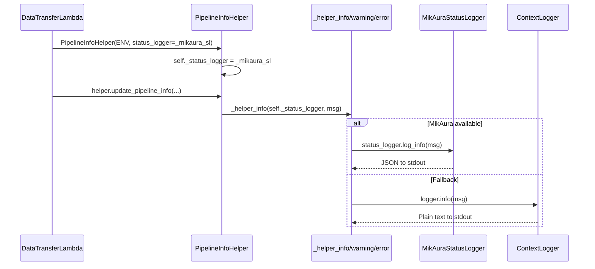

# Migrate pipeline_info_helper to MikAura Structured Logging

## Design Decision: Instance-Level vs Per-Method

The user's brief mentions "Add optional status_logger parameter to helper public methods." Two approaches exist:

- **Per-method**: Add `status_logger=None` to all 15 public methods, plus internal methods like `_discover_brand_retailer_key_format`. Callers must pass at every call site. Convenience methods like `mark_training_complete` that chain to `update_pipeline_info` and `get_pipeline_info` internally would lose the logger mid-chain unless threaded through.
- **Instance-level** (recommended): Add `status_logger=None` to `__init`__, store as `self._status_logger`. All 52 calls use it automatically. Convenience methods that chain (`mark_training_complete` -> `get_pipeline_info` -> `update_pipeline_info`) keep the logger throughout. Lambda callers only change the construction call.

The instance-level approach is recommended because:

1. Zero signature changes on public methods -- fully backward-compatible
2. Chained methods (e.g., `mark_training_complete` calls `get_pipeline_info` then `update_pipeline_info`) carry the logger automatically
3. Only 6 construction sites in the Lambda need updating (vs 7+ call sites for per-method)
4. The helper is already instantiated per-invocation, so instance state is safe

## Scope

### Files Modified (3 files)

- [data_ingestion_pipeline/src/utils/pipeline_info_helper.py](data_ingestion_pipeline/src/utils/pipeline_info_helper.py) -- main migration target (52 logger calls)
- [data_ingestion_pipeline/lambdas/mmm_dev_data_transfer/lambda_function.py](data_ingestion_pipeline/lambdas/mmm_dev_data_transfer/lambda_function.py) -- only Lambda with `PipelineInfoHelper` usage (6 construction sites)
- [data_ingestion_pipeline/tests/layers/storage/unit/test_pipeline_info_helper.py](data_ingestion_pipeline/tests/layers/storage/unit/test_pipeline_info_helper.py) -- add MikAura-aware test coverage

### Files NOT Modified

No other Lambda uses `PipelineInfoHelper` directly -- `get_client`, `stale_data_check`, `data_ingestion_slack`, and `onboarding_pipeline` all interact with DynamoDB via boto3 directly.

---

## Phase 1: Add Wrapper Functions to pipeline_info_helper.py

Create module-level wrapper functions (same pattern as `_transfer_info` et al. in the data transfer Lambda):

```python
def _helper_debug(status_logger, message, debug_event="helper_op", **fields):
    if status_logger:
        status_logger.log_debug(message, debug_event=debug_event, **fields)
    else:
        logger.debug(message)

def _helper_info(status_logger, message, force=True, **fields):
    if status_logger:
        status_logger.log_info(message, force=force, **fields)
    else:
        logger.info(message)

def _helper_warning(status_logger, message, **fields):
    if status_logger:
        status_logger.log_warning(message, **fields)
    else:
        logger.warning(message)

def _helper_error(status_logger, message, reason=None, **fields):
    if status_logger:
        status_logger.log_error(message, reason=reason or message, **fields)
    else:
        logger.error(message)
```

Place these after the logger setup (after line 123) and before the class definition (line 126).

---

## Phase 2: Add Instance-Level status_logger to PipelineInfoHelper

### 2a. Modify `__init`__ signature

In [pipeline_info_helper.py line 158](data_ingestion_pipeline/src/utils/pipeline_info_helper.py):

```python
def __init__(self, environment: str = 'dev', region: str = 'eu-west-1',
             status_logger: Optional[Any] = None):
```

Store immediately: `self._status_logger = status_logger`

### 2b. Modify `get_pipeline_helper` factory

In [pipeline_info_helper.py line 1521](data_ingestion_pipeline/src/utils/pipeline_info_helper.py):

```python
def get_pipeline_helper(environment='dev', region='eu-west-1',
                        status_logger=None):
    return PipelineInfoHelper(environment=environment, region=region,
                              status_logger=status_logger)
```

---

## Phase 3: Convert 52 logger.* Calls to Wrappers

Every `logger.`* call inside `PipelineInfoHelper` methods becomes `_helper_*(self._status_logger, ...)`. The level mapping:


| Method                                | Calls (approx) | Levels                     |
| ------------------------------------- | -------------- | -------------------------- |
| `__init__`                            | 3              | 1 info, 2 error            |
| `build_sort_key` (static)             | 1              | debug                      |
| `parse_sort_key` (static)             | 1              | debug                      |
| `_discover_brand_retailer_key_format` | 4              | 2 debug, 1 info, 1 warning |
| `get_pipeline_info`                   | 6              | 1 info, 4 warning, 1 error |
| `create_pipeline_info`                | 2              | 1 info, 1 error            |
| `update_pipeline_info`                | 14             | 5 info, 4 warning, 5 error |
| `delete_pipeline_info`                | 6              | 4 warning, 1 info, 1 error |
| `list_all_for_client`                 | 2              | 1 info, 1 error            |
| `list_retailers_for_brand`            | 2              | 1 info, 1 error            |
| `list_active_clients`                 | 2              | 1 info, 1 error            |
| `get_clients_due_for_training`        | 2              | 1 info, 1 error            |
| `get_clients_due_for_prediction`      | 2              | 1 info, 1 error            |
| `get_stale_clients`                   | 2              | 1 info, 1 error            |
| `mark_training_complete`              | 1              | info                       |
| `mark_prediction_complete`            | 1              | info                       |
| `mark_data_updated`                   | 1              | info                       |
| `update_drift_metrics`                | 1              | info                       |


**Special cases:**

- **Static methods** (`build_sort_key`, `parse_sort_key`): These have no `self`. Convert them to regular methods, OR pass `None` as `status_logger` since they only log at `debug` level and are called from other instance methods that will log at higher levels. Recommended: leave as static, pass `None` -- the debug log at this level is low-value and the fallback to stdlib is acceptable.
- `**__init__`**: `self._status_logger` is assigned before the DynamoDB connection block, so the wrappers can use it in init logging.

---

## Phase 4: Thread status_logger at Lambda Call Sites

In [mmm_dev_data_transfer/lambda_function.py](data_ingestion_pipeline/lambdas/mmm_dev_data_transfer/lambda_function.py), update all 6 `PipelineInfoHelper(ENVIRONMENT)` constructions to pass the logger:


| Line | Current                                    | Context                                         | Logger variable         |
| ---- | ------------------------------------------ | ----------------------------------------------- | ----------------------- |
| 507  | `helper = PipelineInfoHelper(ENVIRONMENT)` | `handle_spend_regime_shift_actions`             | `status_logger` (param) |
| 789  | `helper = PipelineInfoHelper(ENVIRONMENT)` | `send_kpi_behavior_break_alert` (unused helper) | `status_logger` (param) |
| 914  | `helper = PipelineInfoHelper(ENVIRONMENT)` | `handle_kpi_behavior_break_actions`             | `status_logger` (param) |
| 2928 | `helper = PipelineInfoHelper(ENVIRONMENT)` | `process_with_pandas`                           | `status_logger` (param) |
| 4067 | `helper = PipelineInfoHelper(ENVIRONMENT)` | `update_pipeline_info_after_transfer`           | `status_logger` (param) |
| 4320 | `helper = PipelineInfoHelper(ENVIRONMENT)` | `_run_data_transfer` (nested)                   | `_mikaura_sl`           |


Each becomes: `PipelineInfoHelper(ENVIRONMENT, status_logger=<var>)`

---

## Phase 5: Update Tests

In [test_pipeline_info_helper.py](data_ingestion_pipeline/tests/layers/storage/unit/test_pipeline_info_helper.py):

- Update the `pipeline_helper` fixture to optionally accept a mock `status_logger`
- Add a test class `TestMikAuraIntegration` with cases:
  - `test_init_with_status_logger` -- verify `self._status_logger` is stored
  - `test_init_without_status_logger` -- verify backward compat (None default)
  - `test_wrapper_routes_to_mikaura` -- mock status_logger, call a method, assert `log_info` / `log_warning` / `log_error` called instead of stdlib
  - `test_wrapper_falls_back_to_stdlib` -- pass `status_logger=None`, verify stdlib logger used
  - `test_get_pipeline_helper_passes_status_logger` -- verify factory threads it through

---

## Call Flow After Migration




## Risk Assessment

- **Breaking changes**: None. `status_logger=None` default preserves all existing behavior.
- **Static methods**: Left as-is with stdlib fallback (debug-level only).
- **Unused helper** at line 789: Will pass `status_logger` for consistency even though the helper is constructed but never used for logging operations.
- **Test suite**: Existing 61 tests remain unchanged; new tests are additive.

