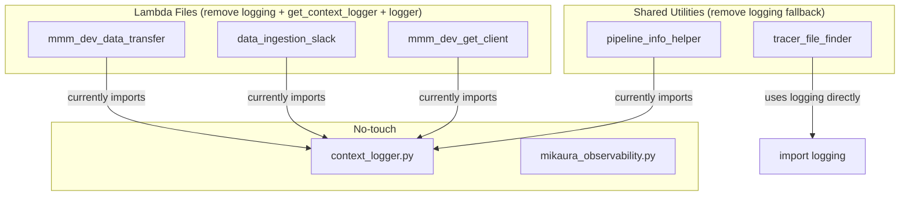

# Remove stdlib logging initialization and fallback mechanisms

## Scope

6 files to modify; 1 file left untouched (reference).




**Gold standard reference:** [stale_data_check/lambda_function.py](data_ingestion_pipeline/lambdas/stale_data_check/lambda_function.py) -- zero stdlib `logger.`* calls, all logging via `MikAuraStatusLogger`.

---

## File 1: [mmm_dev_data_transfer/lambda_function.py](data_ingestion_pipeline/lambdas/mmm_dev_data_transfer/lambda_function.py)

**Remove (4 items):**

- Line 44: `import logging`
- Lines 176-190: The entire `try/except ImportError` block that imports `get_context_logger` and defines the stdlib fallback stub `def get_context_logger(name): return logging.getLogger(name)`. Keep the `ingestion_context` and `get_metrics_utils` imports (move them to a separate try/except or guard them individually).
- Lines 194-195: `logger = get_context_logger(__name__)` and `logger.setLevel(LOG_LEVEL)`

**Update 7 helpers** (lines 198-260: `_transfer_debug`, `_transfer_running`, `_transfer_info`, `_transfer_warning`, `_transfer_error`, `_transfer_failed`, `_transfer_exception`):

Remove every `else: logger.`* branch. Pattern becomes:

```python
def _transfer_info(status_logger, message, force=True, **fields):
    if status_logger:
        status_logger.log_info(message, force=force, **fields)
```

For `_transfer_error`, `_transfer_failed`, and `_transfer_exception`, add a `print()` fallback for critical visibility in CloudWatch:

```python
def _transfer_error(status_logger, message, reason=None, **fields):
    if status_logger:
        status_logger.log_error(message, reason=reason or message, **fields)
    else:
        print(f"[ERROR] {message}")
```

**Replace 3 module-level logger calls** (lines 265-272) with `print()`:

```python
if not PipelineInfoHelper:
    print("CRITICAL: PipelineInfoHelper not available - pipeline-info table updates will fail")
if not STANDARDIZATION_AVAILABLE:
    print("WARNING: Column standardization not available - data validation may be limited")
if not CONFIG_AVAILABLE:
    print("WARNING: Pipeline configuration not available - using environment variable fallbacks")
```

**Keep:** `LOG_LEVEL` env var (still used by `MikAuraStatusLogger.from_config(..., min_level=LOG_LEVEL)` at line 4637).

---

## File 2: [data_ingestion_slack/lambda_function.py](data_ingestion_pipeline/lambdas/data_ingestion_slack/lambda_function.py)

**Remove (4 items):**

- Line 24: `import logging`
- Lines 46-56: The `try/except` block importing `get_context_logger` / `get_metrics_utils` with the stdlib fallback stub. Keep `_slack_metrics` import guarded separately.
- Lines 65-66: `logger = get_context_logger(__name__)` and `logger.setLevel(LOG_LEVEL)`

**Update 5 helpers** (lines 77-119: `_slack_info`, `_slack_warning`, `_slack_error`, `_slack_exception`, `_slack_debug`):

Remove `else: logger.`*. Use `print()` only for `_slack_error` and `_slack_exception`:

```python
def _slack_error(status_logger, message, reason=None, **extra):
    if status_logger:
        status_logger.log_error(message, reason=reason or "slack_delivery", **extra)
    else:
        print(f"[ERROR] {message}")
```

**Fix special case at line 1727-1728** (inside `lambda_handler`):

```python
# Before:
else:
    logger.info(f"Slack notification Lambda started: {execution_id}")
# After:
else:
    print(f"Slack notification Lambda started: {execution_id}")
```

---

## File 3: [mmm_dev_get_client/lambda_function.py](data_ingestion_pipeline/lambdas/mmm_dev_get_client/lambda_function.py)

**Remove (4 items):**

- Line 62: `import logging`
- Lines 124-138: `try/except` block importing `get_context_logger` with fallback stub. Keep `ingestion_context` and `_get_client_metrics` guarded separately.
- Lines 141-142: `logger = get_context_logger(__name__)` and `logger.setLevel(LOG_LEVEL)`

**Update 7 helpers** (lines 145-218: `_get_client_debug`, `_get_client_running`, `_get_client_info`, `_get_client_warning`, `_get_client_error`, `_get_client_success`, `_get_client_exception`):

Remove `else: logger.*`. For `_get_client_success`, remove the entire `else:` block including the inner `if rr is not None` / `else` branch (lines 200-206).

**Fix `write_log_to_s3`** (line 255-256): Replace `logger.error(...)` with `print(...)`:

```python
else:
    print(f"[S3 Logging Error] Failed to write log to S3: {e}")
```

---

## File 4: [pipeline_info_helper.py](data_ingestion_pipeline/src/utils/pipeline_info_helper.py)

**Remove (4 items):**

- Line 99: `import logging`
- Lines 107-114: `try/except` chain importing `get_context_logger` with stdlib fallback
- Lines 122-123: `logger = get_context_logger(__name__)` and `logger.setLevel(logging.INFO)`

**Update 4 helpers** (lines 126-167: `_helper_debug`, `_helper_info`, `_helper_warning`, `_helper_error`):

Remove `else: logger.`* branches. Silently pass when `status_logger` is None:

```python
def _helper_debug(status_logger, message, debug_event="helper_op", **fields):
    if status_logger:
        status_logger.log_debug(message, debug_event=debug_event, **fields)
```

**Impact note:** `build_sort_key` (~~line 316) and `parse_sort_key` (~~line 360) pass `None` as `status_logger`. Their debug output will become silent. This is acceptable per the "silently pass" directive.

---

## File 5: [tracer_file_finder.py](data_ingestion_pipeline/src/utils/tracer_file_finder.py)

This is the largest change: 21 `logger.`* calls throughout the `TracerFileFinder` class, currently using raw `logging.getLogger(__name__)`.

**Remove (3 items):**

- Line 35: `import logging`
- Lines 41-42: `logger = logging.getLogger(__name__)` and `logger.setLevel(logging.INFO)`

**Add optional `status_logger` to `__init_`_:**

```python
def __init__(self, bucket_name, region_name="us-east-1", status_logger=None):
    self._status_logger = status_logger
    ...
```

**Add internal helpers** (similar pattern to Lambda files):

```python
def _log_info(self, message):
    if self._status_logger:
        self._status_logger.log_info(message, force=True)

def _log_debug(self, message):
    if self._status_logger:
        self._status_logger.log_debug(message, debug_event="tracer_file_finder")

def _log_warning(self, message):
    if self._status_logger:
        self._status_logger.log_warning(message)

def _log_error(self, message, exc_info=False):
    if self._status_logger:
        self._status_logger.log_error(message, reason="tracer_file_finder_error")
    else:
        print(f"[ERROR] {message}")
```

*Replace all 21 `logger.` calls** with `self._log_`*:

- 7x `logger.info(...)` -> `self._log_info(...)`
- 8x `logger.debug(...)` -> `self._log_debug(...)`
- 1x `logger.warning(...)` -> `self._log_warning(...)`
- 5x `logger.error(...)` -> `self._log_error(...)` (these get `print()` fallback for CloudWatch visibility)

---

## Files NOT modified

- **[context_logger.py](data_ingestion_pipeline/src/utils/context_logger.py):** This is the utility module itself. It defines `ContextLogger`, `ingestion_context`, and `get_context_logger`. It legitimately wraps `import logging`. No change needed -- it may still be used by `ingestion_context` (which Lambda files import for the context manager, separate from the logger).
- **[mikaura_observability.py](data_ingestion_pipeline/src/utils/mikaura_observability.py):** MikAura implementation. No stdlib logging. No change needed.
- **Other utils** (`s3_helpers.py`, `lambda_helpers.py`, `config.py`, `validation.py`, `column_standardizer.py`, `pipeline_config.py`, `metrics_utils.py`): Already free of stdlib logging -- they use `print()` where needed.

---

## Tests

- Existing tests that mock or assert on `logger.`* calls inside `_transfer_`*, `_slack_*`, `_get_client_*` helpers: verify none exist (exploration confirmed no tests assert on the `else:` stdlib branch in these helpers).
- [test_pipeline_info_helper.py](data_ingestion_pipeline/tests/layers/storage/unit/test_pipeline_info_helper.py) lines 714-722: Test that validates the `_helper_*` stdlib fallback will **need updating** since the fallback is being removed. The test should verify the helper silently passes when `status_logger=None`.
- [test_lambda_sanity.py](data_ingestion_pipeline/tests/layers/compute/sanity/test_lambda_sanity.py) line 111: grep for `'logger.error' in content` -- this check will **fail** since module-level `logger.error(...)` calls are replaced with `print(...)`. Update the sanity check to look for `print(` instead, or remove the assertion.
- Run full test suite: `python -m pytest data_ingestion_pipeline/`

---

## Verification checklist

1. `grep -rn "import logging" data_ingestion_pipeline/lambdas/` returns **zero** matches (only `context_logger.py` in utils should retain it)
2. `grep -rn "get_context_logger" data_ingestion_pipeline/lambdas/` returns only the `ingestion_context` import lines (not logger instantiation)
3. `grep -rn "logger\." data_ingestion_pipeline/lambdas/` returns **zero** matches
4. `grep -rn "logger\." data_ingestion_pipeline/src/utils/pipeline_info_helper.py` returns **zero** matches
5. `grep -rn "logger\." data_ingestion_pipeline/src/utils/tracer_file_finder.py` returns **zero** matches (only `self._log`_*)
6. All tests pass

