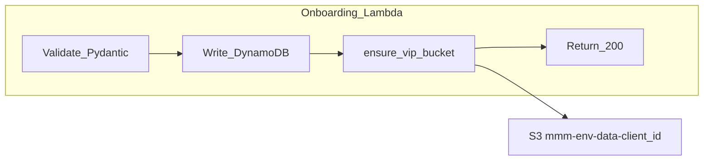

# VIP S3 Bucket Auto-Provisioning on Client Onboarding

## Current state

**Onboarding pipeline** ([onboarding_pipeline/lambda/lambda_function.py](onboarding_pipeline/lambda/lambda_function.py)):

- Receives `POST /onboarding` via API Gateway
- Validates payload (Pydantic), normalizes IDs, writes to `client_metadata` + `pipeline_infos` DynamoDB tables
- Has **no S3 permissions** — only CloudWatch Logs + DynamoDB

**Data ingestion pipeline** ([data_ingestion_pipeline/terraform/vip_buckets.tf](data_ingestion_pipeline/terraform/vip_buckets.tf)):

- Buckets created by Terraform via `for_each = var.client_ids` with name `mmm-{env}-data-{client_id}`
- Security posture: public access block, versioning, SSE-S3/KMS encryption, `BucketOwnerEnforced` ownership, lifecycle (7-day multipart abort), bucket policy (SSL enforcement + Lambda write), optional access logging, CloudWatch 4xx alarm
- Data-transfer Lambda role already has `AmazonS3FullAccess` ([iam.tf L39](data_ingestion_pipeline/terraform/iam.tf)), so it can access **any** bucket without per-bucket IAM changes
- SageMaker role uses wildcard `arn:aws:s3:::mmm-{env}-data-`* ([iam.tf L238](data_ingestion_pipeline/terraform/iam.tf)), already covers new buckets

**The gap:** New clients onboarded via API get DynamoDB entries but no S3 bucket. The next ingestion run fails with `NoSuchBucket`.

---

## Design

Add bucket provisioning **directly into the onboarding Lambda handler**, after the DynamoDB transaction succeeds. This avoids adding a new Lambda, Step Function state, or EventBridge rule.




New module `vip_bucket_provisioner.py` in `onboarding_pipeline/lambda/` mirrors every setting from [vip_buckets.tf](data_ingestion_pipeline/terraform/vip_buckets.tf):

- `CreateBucket` (with `LocationConstraint`)
- `PutPublicAccessBlock` (all 4 flags)
- `PutBucketVersioning` (Enabled)
- `PutBucketEncryption` (AES256 default, SSE-KMS configurable)
- `PutBucketOwnershipControls` (BucketOwnerEnforced)
- `PutBucketLifecycleConfiguration` (abort incomplete multipart after 7 days)
- `PutBucketPolicy` (SSL enforcement deny + data-transfer role write allow)
- `PutBucketTagging` (Name, Environment, Client, Component, Purpose)
- Optional: `PutBucketLogging` (to `mmm-{env}-data-logs`)

**Idempotency:** If `CreateBucket` returns `BucketAlreadyOwnedByYou`, treat as success and still apply configuration (to heal partial failures). If owned by another account, raise.

---

## Changes

### 1. New file: `onboarding_pipeline/lambda/vip_bucket_provisioner.py`

Single function `ensure_vip_bucket(client_id, config)` that performs all S3 API calls above. Config dataclass holds `environment`, `aws_region`, `encryption_type`, `kms_key_arn`, `enable_versioning`, `enable_logging`, `log_bucket`, `data_transfer_role_arn`.

### 2. Modify: [onboarding_pipeline/lambda/lambda_function.py](onboarding_pipeline/lambda/lambda_function.py)

After `write_with_transactions()` returns (around line 327), call:

```python
client_id = normalize_client_id(request.account.name)
ensure_vip_bucket(client_id, vip_config)
```

Add new env vars: `DATA_TRANSFER_ROLE_ARN`, `VIP_ENCRYPTION_TYPE`, `VIP_KMS_KEY_ARN`, `VIP_ENABLE_VERSIONING`, `VIP_ENABLE_LOGGING`.

Bucket creation failure should **not** fail the onboarding API response — log a warning and include `"vip_bucket_created": false` in the response body so operators can fix it.

### 3. Modify: [onboarding_pipeline/terraform/iam.tf](onboarding_pipeline/terraform/iam.tf)

Add an inline policy granting the onboarding Lambda role S3 permissions scoped to `mmm-{env}-data-`*:

- `s3:CreateBucket`, `s3:PutBucketVersioning`, `s3:PutBucketEncryption`, `s3:PutPublicAccessBlock`, `s3:PutBucketOwnershipControls`, `s3:PutLifecycleConfiguration`, `s3:PutBucketPolicy`, `s3:PutBucketTagging`, `s3:PutBucketLogging`, `s3:HeadBucket`

### 4. Modify: [onboarding_pipeline/terraform/lambda.tf](onboarding_pipeline/terraform/lambda.tf)

Add environment variables to the Lambda function resource:

- `DATA_TRANSFER_ROLE_ARN` — reference `data.aws_iam_role.data_transfer.arn` (new data source) or hardcoded pattern
- `VIP_ENCRYPTION_TYPE`, `VIP_KMS_KEY_ARN`, `VIP_ENABLE_VERSIONING`, `VIP_ENABLE_LOGGING`

### 5. Data ingestion pipeline — no changes

The data-transfer Lambda role already has `AmazonS3FullAccess`. `get_vip_bucket_name(client_id)` computes the bucket name identically. Once the bucket exists, ingestion works.

### 6. Unit tests

Add `onboarding_pipeline/tests/test_vip_bucket_provisioner.py` using `moto` to mock S3 and verify:

- Bucket created with correct name and region
- All security settings applied (public block, versioning, encryption, ownership, lifecycle, policy, tags)
- Idempotent on re-run
- Handles `BucketAlreadyOwnedByYou` gracefully

